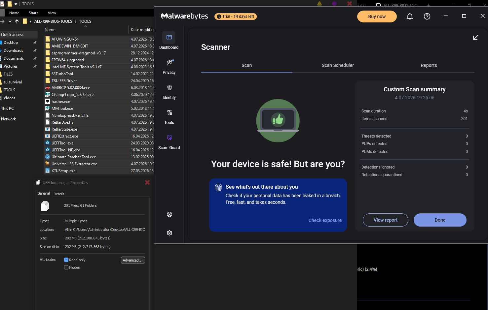

# X99 BIOS Modding Toolkit

**Maintained by:** avkila 

---

## 🛠️ Core Modification Tools

| Tool | Description |
| :--- | :--- |
| **S3TurboTool** | An advanced Turbo Boost unlocking utility for X99 motherboards. Allows for the creation of custom `.ffs` drivers and provides granular control over the FIVR bug (use with caution). |
| **Ultimate Patcher Tool** | An all-in-one automated modding solution for X99 BIOS. Capable of unlocking overclocking, memory timings, Turbo Unlock, ReBar injection, and logo customization. |
| **AMIBCP** | Powerful utility for modifying BIOS menu visibility. Use this to toggle hidden settings and expose advanced menus to the end-user. |
| **MMTool** | The standard for managing BIOS modules. Essential for injecting or extracting microcodes and `.ffs` drivers. |
| **AMIChangeLogo** | Specialized tool for backing up or replacing the OEM boot splash screen (Motherboard/BIOS logo). |

---

## 🔍 Analysis & Extraction

* **UEFITool / UEFITool_NE:** The industry standard for BIOS analysis. The NE (New Engine) version is best for visualization and structure analysis, while the standard version is required for actual image editing and driver injection.
* **UEFIExtract NE:** A command-line utility used to unpack firmware files into a searchable directory structure for deep analysis of volumes and sections.
* **IFR Extractor:** Parses the BIOS Setup module to generate a readable text map of all hidden and visible configuration menus.
* **lzma.exe:** Command-line utility for decompressing and compressing LZMA data blocks within AMI BIOS images.
* **hasher.exe:** Very simple drag and drop software to check SHA256 and MD5 hash. Useful to check the hashes of a BIOS file.

---

## 💾 Flashing & DMI Management

* **FPTW64 (Intel Flash Programming Tool):** A 64-bit utility for dumping and flashing the BIOS region or full SPI image.
  > ⚠️ **Note:** Requires "BIOS Lock" to be disabled via AMIBCP or Grub shell. Please make sure R/W permissions also exist within the BIOS. If they are not granted you will need to use CH341A.
* **AFUWINGUIx64:** A GUI-based alternative to FPT for flashing AMI BIOS. Shares the same "BIOS Lock" requirements as FPT.
* **AsProgrammer:** The preferred software for use with CH341A hardware programmers. Highly recommended for recovering from bricks or flashing boards with locked descriptors.
* **AMIDEWIN / DMIEDIT:** Tools for reading and writing DMI/SMBIOS data (Serial Numbers, UUIDs, Asset Tags). DMIEDIT provides a user-friendly GUI.

---

## 🚀 Performance & Feature Drivers

* **ReBarDxe.ffs:** EFI driver for Resizable BAR support. Requires Secure Boot to be OFF.
* **ReBarState.exe:** CLI tool to configure the ReBar size. A value of 2^32 is recommended for maximum VRAM utilization. (Max VRAM size also works. Ex. 8192MB (8GB) = 2^13 etc.)
* **NVME.ffs:** Driver for adding NVMe boot support to older UEFI motherboards that lack native M.2 boot capabilities.
* **XTUSetup (v6.4.2.40):** A specific Intel XTU version compatible with Chinese X99 boards. Allows for overclocking provided the BIOS has been prepped (e.g., via AMIBCP). For Broadwell chips, use 7.0.6.37.
* **ME System Tools v9.1 R7:** Tools for modifying the Intel Management Engine. Useful for fixing BCLK at exactly 100MHz (disabling Spread Spectrum). You can also BCLK overclock, but it is really risky.
  > 📌 **Supported Chipsets:** Q87, H87, Z87, B85, H85, Q97, H97, Z97. Genuine C612 works too.

---

## ⚠️ Disclaimer

> 🛑 **USE AT YOUR OWN RISK.**
> 
> I am not responsible for any damages including, but not limited to: bricked motherboards, fried VRMs, hardware failure, or data loss. BIOS modding carries inherent risks of permanent hardware damage. Always have a CH341A programmer and a backup of your original BIOS before proceeding.

---

## 🕒 Changelog (DD MM YYYY)

* **11.04.2026:** Added ReBarDxe and NVME `.ffs` drivers. Included injection instructions for UEFITool.
* **11.04.2026:** Added UEFITool (Standard) and UEFIExtractNE; updated documentation.
* **27.04.2026:** Patched AFUWINGUI to resolve execution errors.
* **29.05.2026:** Removed leftover files.
* **20.06.2026:** Rewrote the TBU FFS Driver readme file and fixed a type on `readme.md`. Also fixed the repo page where the readme file was shown in literal raw text instead of polished.
* **23.06.2026:** Removed checksum.exe. Added a new software, hasher. You can just drag and drop your files in there to check MD5 and SHA256. Written in Python.
* **04.07.2026:** I have added some badges so its easier to navigate through the readme file. No tool update or anything new. I won't be adding this to the releases.
* **04.07.2026:** Emergency cleanup is done. None of the files pose a threat in any AV. Please do NOT use the old commits. Wapomi is completely harmless in 2026 but its still a malware. 
* **09.07.2026:** Enjoyed my birthday event. I just noticed I forgot to rename "neoprogrammer" to "asprogrammer" in readme.md file. Fixed. Files are still safe to use.

---

**Note:** In 4th of July 2026 "Wapomi.Virus.FileInfector" has been found in the repo files. Even though Wapomi is a malware from 2000's and is completely harmless in 2026 (unless you are running windows xp 32bit like a chad) it is still better for me to add a small note about it. The repo is completely cleaned out. If you happened to use a fork of it, or happened to use one of my old commits please do not run anything and uninstall the folder. If you have ran it, your data is completely safe however you will get annoying "unsupported 16 bit application" error in temp files.

**PLEASE STAR THE REPO IF YOU FIND YOURSELF DOWNLOADING AND USING IT! BUDGET COMPUTERS NEVER DIE.**
